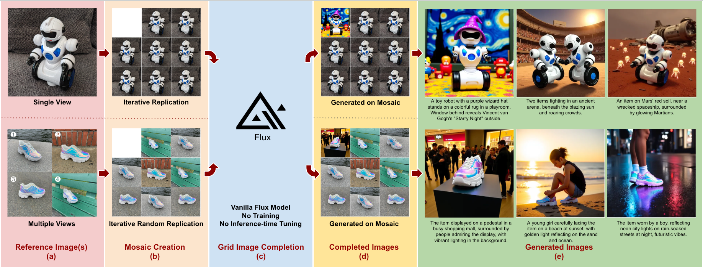

# LatentUnfold




**<a href="https://arxiv.org/abs/2504.11478" target="_blank" rel="noopener">Flux Already Knows – Activating Subject-Driven Image Generation without Training</a>**  
Hao Kang*, Stathi Fotiadis*, Liming Jiang, Qing Yan, Yumin Jia, Zichuan Liu, Min Jin Chong, and Xin Lu 
<br />Bytedance Intelligent Creation
<br />
<a href="https://bytedance.github.io/LatentUnfold/"></a> &ensp;
<a href="https://arxiv.org/abs/2504.11478"></a> &ensp;

**Abstract**  
We propose a simple yet effective zero-shot framework for subject-driven image generation using a vanilla Flux model. By framing the task as grid-based image completion and simply replicating the subject image(s) in a mosaic layout, we activate strong identity-preserving capabilities without any additional data, training, or inference-time fine-tuning. This “free lunch” approach is further strengthened by a novel cascade attention design and meta prompting technique, boosting fidelity and versatility. Experimental results show that our method outperforms baselines across multiple key metrics in benchmarks and human preference studies, with trade-offs in certain aspects. Additionally, it supports diverse edits, including logo insertion, virtual try-on, and subject replacement or insertion. These results demonstrate that a pre-trained foundational text-to-image model can enable high-quality, resource-efficient subject-driven generation, opening new possibilities for lightweight customization in downstream applications.

---

## Quick Start
1. **Environment setup** (may need to modify bootstrap.sh accordingly)
```bash
source bootstrap.sh
```
2. **Run example**
```bash
# Basic Call
python3 run_latent_unfold.py 
```

```bash
# Gradio Demo
python3 app.py 
```
---

## License
This repository is licensed under the Apache 2.0 License.

---

## Acknowledgement
We would like to express our gratitude to the authors of the following repositories, from which we referenced code, model or assets:
<br />https://github.com/huggingface/diffusers
<br />https://github.com/wooyeolbaek/attention-map-diffusers
<br />https://github.com/Yuanshi9815/OminiControl
<br />https://github.com/google/dreambooth
<br />https://huggingface.co/briaai/RMBG-2.0
<br />https://huggingface.co/black-forest-labs/FLUX.1-dev

---

## Citation
If you find this work useful in your research, please consider citing: 

```bibtex
@article{kang2025latentunfold,
      title={Flux Already Knows - Activating Subject-Driven Image Generation without Training}, 
      author={Kang, Hao and Fotiadis, Stathi and Jiang, Liming and Yan, Qing and Jia, Yumin and Liu, Zichuan and Chong, Min Jin and Lu, Xin},
      journal={arXiv preprint}, 
      volume={arXiv:2504.11478},
      year={2025},
}
```